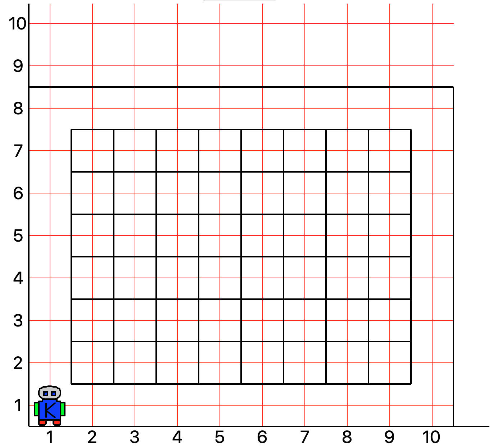
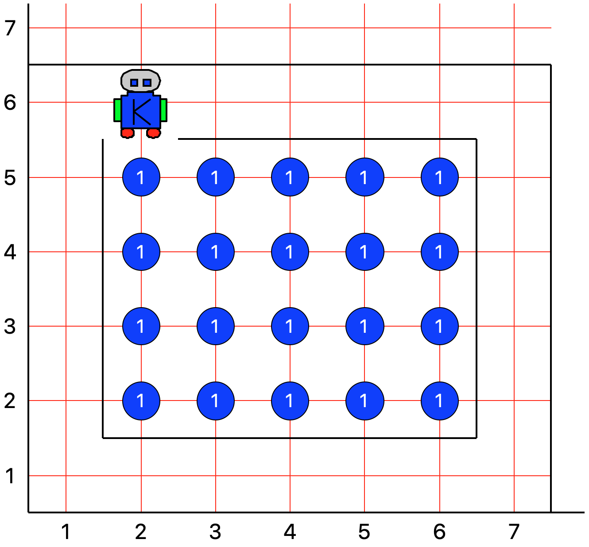
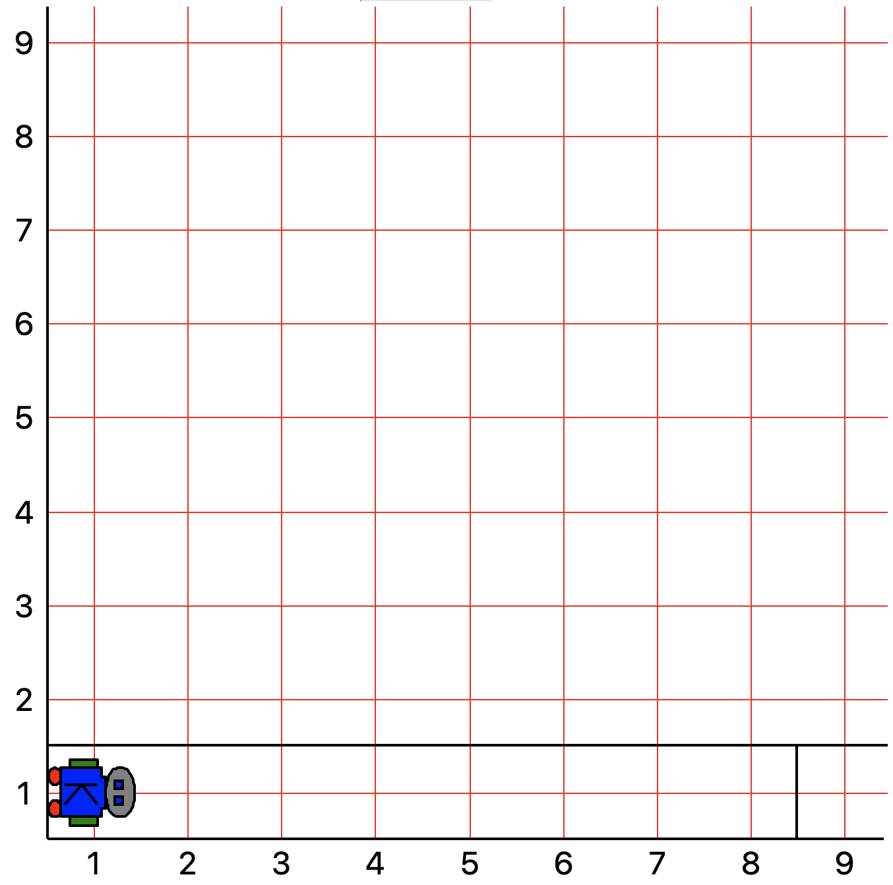
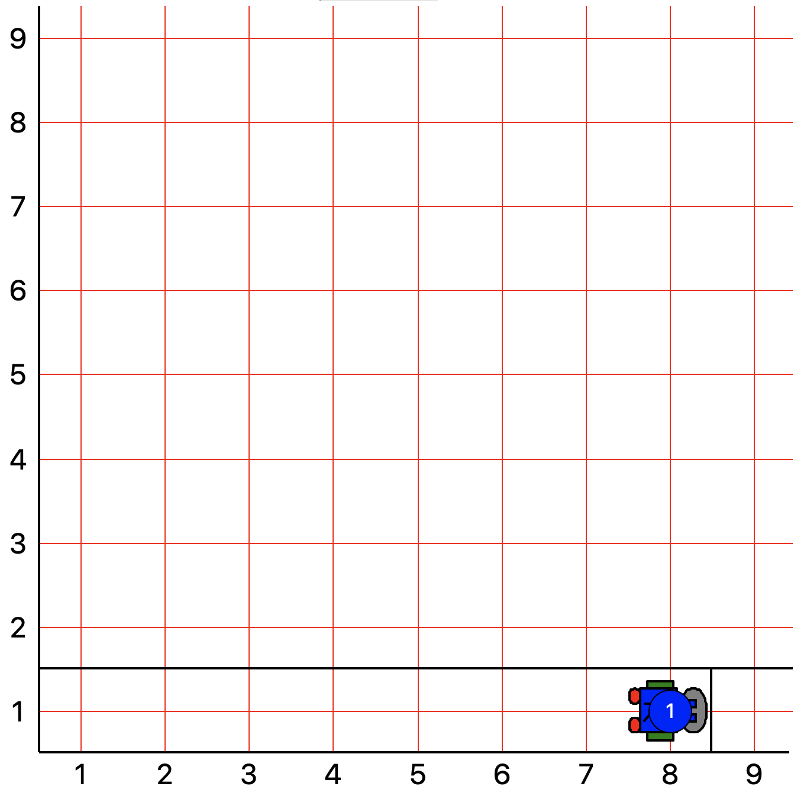
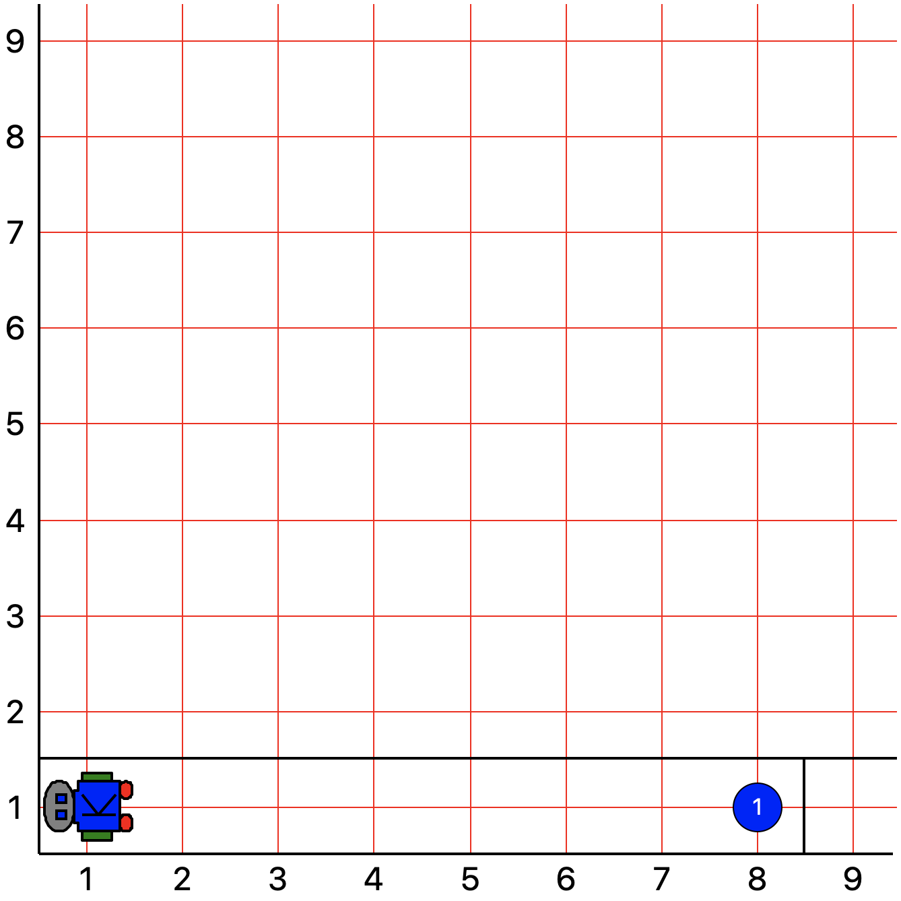
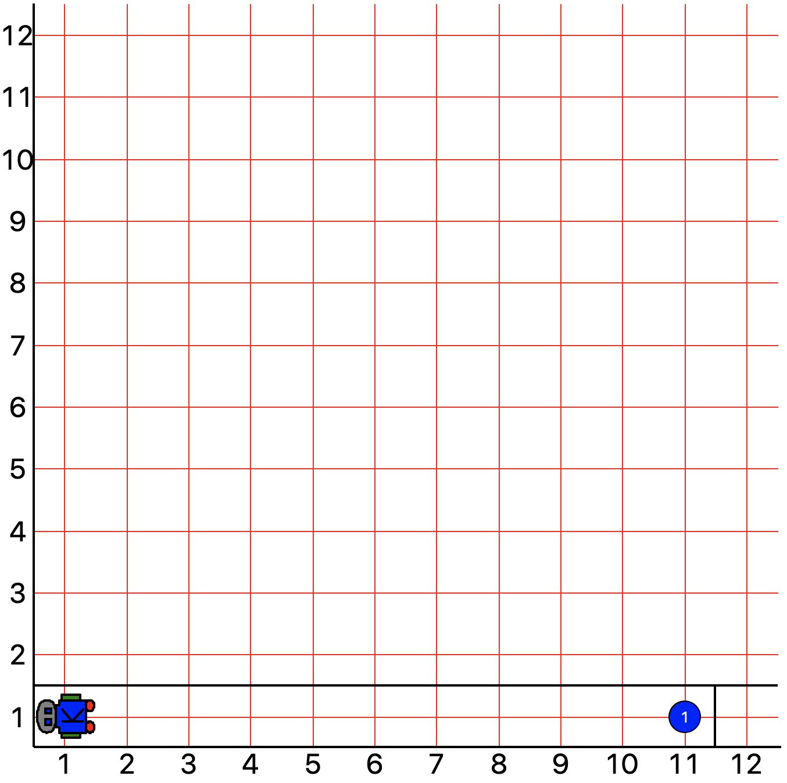

## CS-UY 1114 — Lab 1
# Karel Basics
#### February 5th, 2021

You will need a working Karel environment installed on your computer for this lab. **If you need help with this, please
contact a teaching assistant or instructor ASAP!**

All lab work must be submitted within **24 hours of the start of your lab period on Gradescope** (we will be checking
this using the timestamps of your last submission on GradeScope). This, of course, also means that if you submit a
solution before your allotted lab time, you will get no credit. You must try each problem at least once (that is,
submitting at least one attempt to GradeScope, whether it is correct or not). You are welcome to continue to work on
the problems and continue submitting to Gradescope until you are satisfied with your results. It is your responsibility
to remember to submit your work.

Please note that your overall point value is awarded by the teaching assistants verifying that you attempted and
submitted each problem at least once!

### Karel Instruction Set

For your convenience, we are including Karel's native instruction set below:

|Function|Description|
|---|---|
|move()|Makes Karel move forward one square in the direction it is facing. Errors if there is a wall in front of Karel.|
|turn_left()|Makes Karel turn left.|
|pick_beeper()|Makes Karel pick up a beeper from the corner where it is currently standing. Errors if there are no beepers present on the corner.|
|put_beeper()|Makes Karel place a beeper on the corner where it is currently standing.|

And below, you will find the boolean expressions available for Karel programs:

|Function|Description|
|---|---|
|front_is_clear()|Is there no wall in front of Karel? Evaluates to `True` if answer is `Yes` and `False`, otherwise.|
|left_is_clear()|Is there no wall to Karel’s left? Evaluates to `True` if answer is `Yes` and `False`, otherwise.|
|right_is_clear()|Is there no wall to Karel’s right? Evaluates to `True` if answer is `Yes` and `False`, otherwise.|
|on_beeper()|Is there a beeper on the corner where Karel is standing? Evaluates to `True` if answer is `Yes` and `False`, otherwise.|
|facing_north()|Is Karel facing north? Evaluates to `True` if answer is `Yes` and `False`, otherwise.|
|facing_south()|Is Karel facing south? Evaluates to `True` if answer is `Yes` and `False`, otherwise.|
|facing_east|Is Karel facing east? Evaluates to `True` if answer is `Yes` and `False`, otherwise.|
|facing\_west()|Is Karel facing west? Evaluates to `True` if answer is `Yes` and `False`, otherwise.|
|||


### Problem 1: Time to Run The Mile

Before we begin, we would like to remind you that you have access to the _Karel_In_PyCharm_ guide, and may be
useful if you get stuck with running Karel programs. This guide/tutorial can be found in the **Resources** folder in 
NYU Classes.

Okay, let's start with something simple. Pretend that Karel has to run a full lap around a 8x7 track-and-field course, 
such as the one shown below:



_**Figure 1**: World `lab01_1.kwld`_

As you can see, Karel starts in a north-facing position, at location (1, 1). Your first task is to create a function,
called **`run_lap()`**, that will have Karel complete a full lap around this track, ending once again at position (1, 1)
and in a north-facing position. You may define any other helper  functions that you believe might help you to implement 
`run_lap()`.

For this problem, you may assume that neither the dimensions of the track nor Karel's initial position and direction 
will ever change. We have included sample comments in the skeleton **`run_lap()`** function in the file 
[**track_karel.py**](track_karel.py) to give you an example of our expectations regarding proper documentation. Please 
follow this format for the documentation of the rest of your functions!


### Problem 2: Check the Septic Tank!

For the next problem, we will pretend  our track is now a container, to be filled with beepers, and we've been
tasked with programming Karel to do so. You should do this in the [**container_karel.py**](container_karel.py) file.
Karel’s initial world is shown below: :


_**Figure 2**: World `lab01_2.kwld` pre-conditions._

with pre-conditions being that  Karel start at position (1, 1), facing north. Create a function, **`fill_container()`** 
(and any additional helper functions), such that the ending state of the world matches the image below:



_**Figure 3**: World `lab01_2.kwld` post-conditions._

The post-conditions here include that the container has 1 beeper on each "space", Karel is located at position (6,1), 
and facing North. You may find that the instruction set inside **`fill_pothole()`** will get pretty large pretty 
quickly. This is where creating helper functions is useful. For example, if you find that you are constantly using the 
following three instructions:

```python
# 11 lines of code...
turn_left()
move()
turn_left()

move()

turn_left()
move()
turn_left()

move()

turn_left()
move()
turn_left()
```

you may find it helpful to create the following function:

```python
def left_u_turn():
   turn_left()
   move()
   turn_left()

# The same instructions are now 5 lines
left_u_turn()

move()

left_u_turn()

move()

left_u_turn()
```

and use **`left_u_turn`** instead of the other three. It is completely up to you how you choose  to structure your code. Your program only needs to work in world `lab01_2.kwld`.  As always, ask any of the TAs for help should you need any guidance!

### Problem 3: Roadblocks

Your final task will make use of the `while` loop control structure that you learned about in lecture.

Karel will begin in position (1, 1), facing east:



_**Figure 4**: Initial state of world `lab01_3.kwld`_

Write a function called **`travel_and_place_beeper()`** in the file [**roadblocks.py**](roadblocks.py) that will instruct
Karel to travel forward until a wall is directly in front of Karel. Once Karel reaches that point, it will place a beeper on this corner:



_**Figure 5**: World `lab01_3.kwld` after beeper placement._

Karel will then make a 180-degree turn and travel back to its original position, but facing west:



_**Figure 6**: Final state of world `lab01_3.kwld`_

This program must work for a world with ***any number of avenues (columns)***, such as the following world:



_**Figure 7**: Ending state of world `lab01_4.kwld`which _

This second world can be loaded by running the `roadblocks2` configuration.

Naturally, you must make use of a `while` loop in order to complete this problem. Please reach out to your TAs if you
need guidance on properly using a `while` loop. Good luck!

